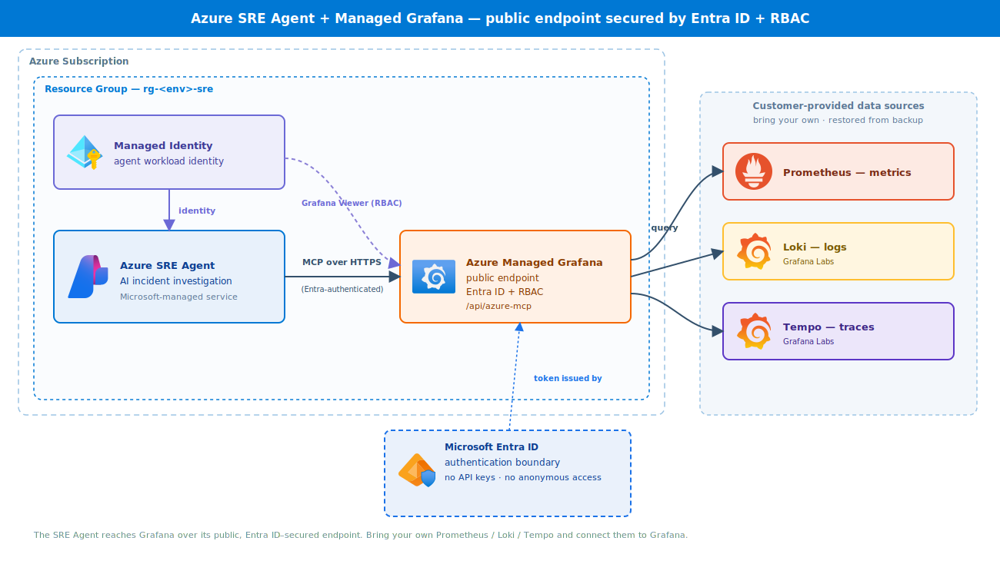

# Deployment guide

End-to-end deployment of the private-by-default Azure SRE Agent + Managed Grafana sandbox.



## Prerequisites

- Azure subscription with permission to create resource groups, networking, and role assignments (Owner or User Access Administrator + Network Contributor + Contributor).
- [Azure CLI](https://learn.microsoft.com/cli/azure/install-azure-cli) `az`.
- [Azure Developer CLI](https://learn.microsoft.com/azure/developer/azure-developer-cli/install-azd) `azd` (recommended).
- A region that supports the Azure SRE Agent: **swedencentral, uksouth, eastus2, australiaeast, francecentral, canadacentral, koreacentral**.

Register the resource providers once (the preflight warns if any are missing):

```bash
az provider register --namespace Microsoft.App
az provider register --namespace Microsoft.Dashboard
az provider register --namespace Microsoft.ManagedIdentity
az provider register --namespace Microsoft.Network
```

## Networking model

| Mode | `enablePrivateNetworking` | `grafanaPublicNetworkAccess` | Result |
| --- | --- | --- | --- |
| **Private-only (default)** | `true` | `Disabled` | VNet + private endpoint; Grafana reachable only from the VNet |
| **Private + public** | `true` | `Enabled` | VNet + private endpoint, but Grafana also reachable publicly (use if the SRE Agent can't reach private Grafana) |
| **Public only** | `false` | *(ignored, forced Enabled)* | No VNet/private endpoint; public endpoints + Entra/RBAC |

> ⚠️ The Azure SRE Agent is Microsoft-managed and has no VNet injection today. Validate that it can reach a **private** Grafana in your tenant. If it can't, use **Private + public**.

## Option A — azd (recommended)

```bash
azd auth login
azd env new sreagent-sbx
azd env set AZURE_LOCATION swedencentral

# Networking (defaults shown):
# azd env set ENABLE_PRIVATE_NETWORKING true
# azd env set GRAFANA_PUBLIC_NETWORK_ACCESS Disabled

azd up
```

What happens:
1. **preprovision** → `scripts/preflight-region` validates region + providers.
2. **provision** → `infra/main.bicep` creates the RG, identity, Grafana, SRE Agent, RBAC, and (when enabled) the VNet, Private DNS zone, and Grafana private endpoint.
3. **postprovision** → `scripts/show-access` prints the access summary, including the networking posture.

## Option B — az CLI

```bash
az deployment sub create \
  --name sre-sandbox \
  --location swedencentral \
  --template-file infra/main.bicep \
  --parameters environmentName=sreagent-sbx location=swedencentral \
               enablePrivateNetworking=true grafanaPublicNetworkAccess=Disabled
```

Grant yourself agent access during deployment:

```bash
  --parameters agentAccessPrincipalId=$(az ad signed-in-user show --query id -o tsv)
```

## Parameters

| Parameter | Required | Default | Description |
| --- | --- | --- | --- |
| `environmentName` | yes | — | Deterministic resource naming |
| `location` | yes | — | SRE Agent-supported region |
| `resourceGroupName` | no | `rg-<environmentName>-sre` | Override RG name |
| `tags` | no | `{}` | Tags on every resource |
| `agentAccessPrincipalId` | no | `` | Principal granted SRE Agent Standard User |
| `agentAccessPrincipalType` | no | `User` | `User`, `Group`, or `ServicePrincipal` |
| `enablePrivateNetworking` | no | `true` | Deploy VNet + Private DNS + Grafana private endpoint |
| `grafanaPublicNetworkAccess` | no | `Disabled` | Grafana public access when private networking is on |
| `vnetAddressPrefix` | no | `10.42.0.0/24` | VNet address space |
| `privateEndpointSubnetPrefix` | no | `10.42.0.0/26` | Subnet for private endpoints |

## Outputs

| Output | Description |
| --- | --- |
| `AZURE_RESOURCE_GROUP` | Resource group name |
| `AZURE_GRAFANA_ENDPOINT` | Grafana URL |
| `AZURE_GRAFANA_MCP_ENDPOINT` | Grafana MCP endpoint (`…/api/azure-mcp`) |
| `AZURE_GRAFANA_PUBLIC_NETWORK_ACCESS` | Effective Grafana public-access setting |
| `AZURE_PRIVATE_NETWORKING_ENABLED` | Whether private networking was deployed |
| `AZURE_VNET_ID` | VNet resource ID (empty if private networking off) |
| `AZURE_SRE_AGENT_ID` / `AZURE_SRE_AGENT_NAME` | SRE Agent identifiers |
| `AZURE_USER_ASSIGNED_IDENTITY_*` | Managed identity IDs |

## Validate the template locally

```bash
az bicep build --file infra/main.bicep --stdout > $null
```

(Benign `BCP318` warnings about conditional module outputs are expected.)

## Reaching a private Grafana

When `grafanaPublicNetworkAccess = Disabled`, the Grafana UI/API resolves to a private IP and is only reachable from the VNet. Add one of:
- **Azure Bastion + jumpbox VM** in the VNet (or a peered VNet).
- **VPN / ExpressRoute** into the VNet.
- A **peered hub** with existing connectivity.

The template does not deploy Bastion/jumpbox — wire up access to suit your environment.

## Troubleshooting

| Symptom | Cause | Fix |
| --- | --- | --- |
| Preflight fails on region | Region not supported | Pick a supported region |
| Agent can't connect to Grafana (private) | SRE Agent can't reach private endpoint | Redeploy with `grafanaPublicNetworkAccess=Enabled` |
| Can't open Grafana UI | Public access Disabled | Reach it from inside the VNet (Bastion/VPN) |
| Can't use the agent | Missing data-plane role | Grant SRE Agent Reader+ on the agent (Owner is not enough) |
| Access just granted but blocked | RBAC propagation | Wait 5–10 min; confirm account/tenant |
| Grafana shows no data | No data sources added | Add your data sources (restore from backup) |

## Clean up

```bash
azd down --purge --force
# or
az group delete --name <resource-group> --yes --no-wait
```
